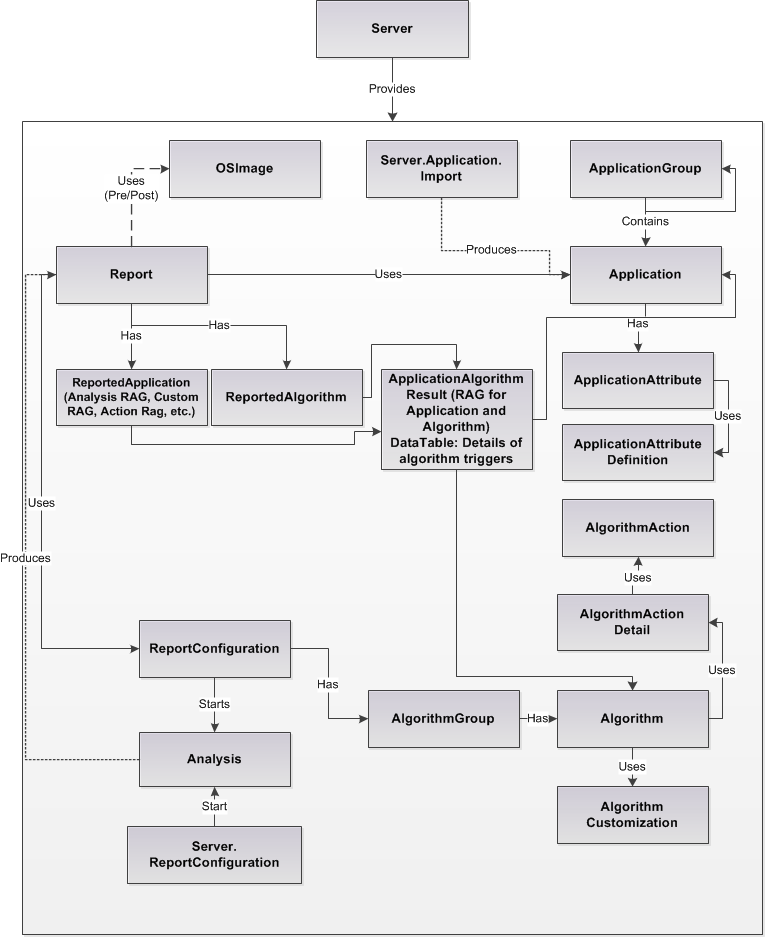

#Data available using the SDK
This topic describes the data that can be accessed using the AppDNA SDK.

The AppDNA SDK exposes various data types, as shown in the following diagram:




##Categories of Data

The following data is exposed by the SDK:

- Server - represents a connection to a specific AppDNA instance (database).

- Application - represents the result of an installation command. This can be analyzed and reported against.

- ApplicationGroup - a collection of Application objects. Groups make it easy to review and report on the applications in the group separately from the rest of the portfolio.

- ApplicationAttributeDefinition - a definition of an attribute, including an identifier.

- ApplicationAttribute - a value which is associated with an Application and an

- ApplicationAttributeDefinition. OSImage - represents an OS image which can be imported, and used to qualify the results of a report.

- ReportConfiguration - represents a reporting entity, against which applications can be analyzed and from which a report can be retrieved.

- AlgorithmGroup - a system-defined grouping of algorithms.

- Algorithm - logic that can be applied to an application. Each algorithm is designed to identify applications that may encounter an issue on the target platform. Applications identified as having this issue are said to trigger the algorithm.

- Report - represents the results of an analysis of applications against the algorithms in a ReportConfiguration.
