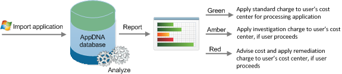

#SDK
These topics introduce the AppDNA software development kit (SDK), describe what data is available, and how to develop using the AppDNA SDK. Examples are provided to illustrate the SDK's use. These topics are aimed at experienced administrators and developers who are familiar with using SDKs.
##Why use the AppDNA SDK?
The SDK enables you to provide AppDNA within a process or user interface that your users are familiar with, or within a simple web page. In this way, users avoid having to spend time on familiarization with the AppDNA user interface because the AppDNA tasks are meshed seamlessly into their usual workflows.

The following examples illustrate how you can use the AppDNA SDK:

##Show AppDNA results within an existing application

If you already have an existing application where users can request a new application, you can use the AppDNA SDK to show the results of compatibility testing. Adding a screen that shows whether the new application is compatible with the preferred IT deployment methods (OS version, virtual or physical, use of App-V or not) is a useful, if not mandatory, step. The user needn't know what the compatibility problem is; all they need to know is whether the application is compatible or not. If it is compatible, they can then proceed to testing; if incompatible, the application request can be escalated to IT. Behind the scenes, the existing application just needs to upload the requested application and call the AppDNA API to import, analyze, and report its RAG result. The following illustrates a typical example:

##Use AppDNA results to guide an automated workflow

Where workflow or orchestration solutions guide applications automatically from one step to another without manual intervention, you can use the AppDNA SDK to automate the compatibility testing step. The workflow solution needs to know the result of compatibility testing with a specific technology so as to guide the workflow to the appropriate next step. You can call the AppDNA SDK to import, analyze, and report the RAG result for the selected technology so the workflow can function accurately, removing the need for this to be done manually. Automating this step may save several days in the process of adding a new application and reduce the wait time for users. The following illustrates a typical workflow:

##Provide a self-service system for application owners

Increasingly, IT departments are reducing costs and wait times by asking users to do more for themselves. You can use the AppDNA SDK to provide users who want to add a new application to the corporate environment with easy access to AppDNA, without the need to learn how to run it or interpret the reports. Using the SDK, you can provide a simple program or web page that calls AppDNA. For example, the web page may prompt for the user's cost center, provide a function to directly upload the application from the user's machine and import it into AppDNA, and then return the RAG result. The following illustrates a typical self-service system:

